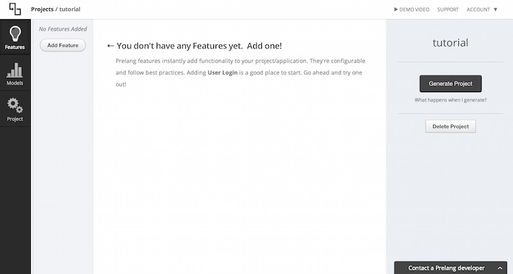
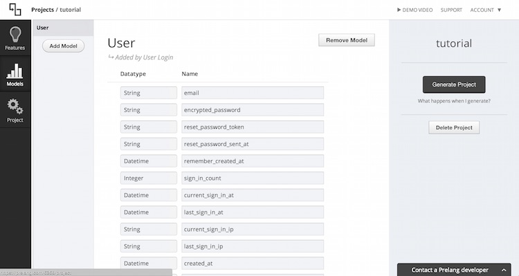

# Automated Rails Apps with [Prelang]

Scaffolding and auto-generation are common with Rails applications. The ability to spin up an application or scaffold a feature is easy with simple command line operations. Prelang, a free service built by [Erik Nomitch], takes this automation to the next level. Using the handy GUI provided, it is easy to not only create an application, but implement common features like user login/authentication and model entire databases without ever writing a piece of code. So...let's try it out.

##Getting Started

Begin by heading over to the [Prelang] site. Sign in with your Github account as this is where the automated app will be placed upon completion.

You can check out Erik's video in the upper-right hand corner of the [Prelang] site for some familiarity, but it's not necessary.

- When you're ready, click create project on the left-hand side.
 - Specify a project name (for SLP this will be your project tag provided by Bloomfield) 
 - Specify for you Database -- as of now (12/2014), only SQLite3 and PostgreSQL are available (for SLP select SQLite3, although PostgreSQL is the common selection for Rails apps)
- Again, click create project, you're screen should match the image below -- excluding the app name



##Adding Features
Next, let's add a few features. This portion is incredibly powerful, allowing seamless addition of things like user login, bootstrap, testing, liking/voting, Admin, etc. Let's add some common ones. 
- Since you will likely want Bootstrap, click the 'Add Feature' button on the left and select 'UI Framework'
- You will be presented with a few options
 - Select the default colors for your application
 - Toggle whether you would like a Bootstrap navbar and flash messages (just Rails pop-ups). You probably want these
- Congrats, you now have Twitter Bootstrap, a color template, navbar and Rails messages. Tough huh?

Let's add another feature, maybe something more robust?
- Again, click the 'Add Feature' button and select 'User Login'
- Click Add Feature
 - If you have some familiarity with Rails, you've probably heard of Devise. This is how Prelang handles users as well, and if you've ever included it manually, it's no simple task (For SLPer's, there's a tutorial on it) 
 - You have a few toggle items here as well
   - Feel free to add Facebook Login and/or username login if that suits your app.
   - Ensure Editable Views, Editable Controllers and Stylized Paths are all toggled 'On'-- you will want the ability to edit these things in the future
- Great, now you have user login/authenticity as well.

Feel free to add any other features you may like, many of them are incredibly useful.

#####For the Sake of Clarity


In this graphic, User Login support is toggled off, and Editable Views is toggled on.

###Feature Suggestions for SLP
My suggested features for all SLP projects (other features are project dependent):
* User Login
* UI Framework
* Admin Framework
* Scaffolding
* ENV Variables
* Root Route
* Error Enhancement
* Form Enhancement

By the time you're using this, it is likely things like Search, File Upload, Ordering, and Tagging will be completed as well (they're in beta now). Feel free the add them as is necessary for your application.

For more information on any of these, Prelang links to some documentation. You can check that out, or a quick <i>Google</i> will likely suffice. Each of these could be a tutorial within themselves.

Again, Congrats, you likely now have some amount of your minimum requirements completed for your SLP project!

###Moving Forward
Once you've specified all the features you'd like thrown in automatically, move to the database. On the left-hand side, click 'Models'.

If you specified 'User Login' as a feature, you will be presented with this screen:


###The Models
For this section, it is assumed you have some previous Database knowledge and have discussed/decided with your SLP team which Models will be necessary for your application. 

For the sake of tutorialization, there's no way to foreshadow the Models necessary in your application, so here's an overview of what things mean and how to define them.
* For any Prelang Model you can define any number of 'Datatypes' and affiliated 'Names'
 * The Datatype selections are provided (in dropdown format) per Rails specifications and as you can imagine specify the type
 * The Name is how you will reference the Model object
* To see the potential, click 'Add Attribute or Relation' at bottom
 * From the dropdown you can select any core Rails Datatype, be it Relational, NonRelational, or Plug-in.
 * As with any database specification, you then affiliate this type with a name
* Now, go ahead and create the Models necessary in your application, as produced by your team. The GUI makes this process much easier than the numerous command line operations in Rails. 

And there it is. You have Models which will be editable on project generation. Prelang will also throw in validation testing for these.

For SLP, it is likely you will want to add numerous Models (beyond the generated <i>User</i> Model which you may want to edit), whether it be a Shift, Team, Group, etc. This, of course, all depends on your project.

To create a new Model, simply click the 'Add Model' button the left-hand side, specify a Model name and begin adding attributes/relations!

###So You Built Your Models...
At this point, you have fleshed out the Models specific to your project, and you still haven't written a line of code...

We're almost there.

###System Specs
Move forward by clicking the 'Project' icon on the left-hand side.

Complete the two required fields:
* 'Displayed Name' specifies the title of your App -- as it will appear in your HTML pages.
* 'System Name' effectively correlates to your Github Repository name
    * For SLP: this will be the tag provided by Bloomfield

You may click the System tab on the left-hand side to check it out, but it just displays the Rails version and Database. For SLP the default is as specified by Bloomfield, so you're good!**

Now click the 'Metadata' tab and specify your Tagling and Description. For SLP this is likely something along the lines of:<br>
SLP Project [year] for [Bloomfield tagline]***<br>

**Note this is correct as of the 2014-2015 iteration of SLP, you should verify this in the future. <br>
***Note this is entirely optional.

###Guess What, You're Done with Prelang
Feel free to go back through any of the information entered thus far by using the tabs on the left-hand side. Once you're happy with it, you're done!

Click 'Generate Project' on the right-hand side. When you do this, Prelang will generate your Rails App and push it your Github Repo (you logged in with it, remember?) using the repo name you specified.

This may take a minute or two-- all depending on the generating queue.

###Start Coding (SLP Specific)
You will need [rbenv] and Git installed for this. You will likely need these anyway, they're good to have. Also, you're rails environment should be setup. If you're using the VM, Bloomfield has done this, otherwise it's your responsibility (although not terribly challenging).

Next, click the 'View on Github' button on the right-hand side. Look at that, you're repo is initialized!

SLP Setup:
* Open a terminal and cd into your desired directory
```
$ git clone [enter URL from Github here]
```
* There's the repo, let's get it in Bloomfield's private repo for your project:
```
$ cd LOCAL_REPO_NAME
$ git remote rename origin upstream
$ git remote add origin URL_TO_SLP_REPO
$ git push origin master
```
* Great, now you have added the generated code to Bloomfield's private repo-- where it should be. Next, let's get the app and running!
* From the root of your application (where you ran the above commands)
```
$ ./prelang-init
```
* This command will install all dependencies through Bundle and create/ migrate your database per your model specifications. At conclusion, you will be prompted to start a Rails server, type 'y'.
* Open your browser of choice to: http://0.0.0.0:3000/

There it is, you have an app up and running with all the features and database specifications you selected in just a few minutes!

##An Aside
Prelang is realitively new with only a few thousand users. Although there isn't much documentation, Erik is incredibly responsive. For any issues or concerns, don't hesistant to shoot him an email. 

### Version
1.0.0

[Prelang]:https://prelang.com/
[Erik Nomitch]:https://github.com/eriknomitch
[rbenv]:https://github.com/sstephenson/rbenv
